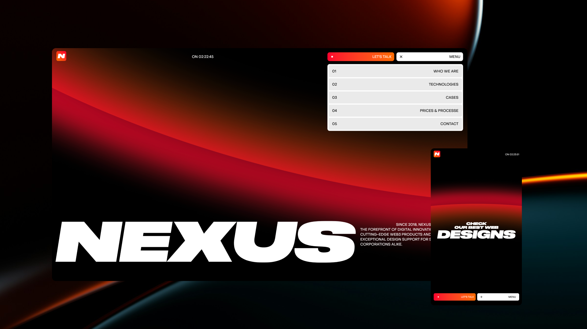

# Nexus Web Agency



A cutting-edge web design and development agency website featuring modern Web3 aesthetics, smooth animations, and interactive project showcases. Built with advanced technologies and optimized for exceptional user experience.

## 🎯 Features

- **Modern Web3 Design** - Futuristic interface with blockchain-inspired aesthetics
- **Advanced Animations** - Smooth GSAP animations with scroll triggers and split text effects
- **Interactive Project Cards** - Sticky cards with dynamic content presentation
- **Smooth Scrolling** - Lenis integration for buttery-smooth scroll experience
- **Loading Animations** - Professional loader with progress tracking
- **Responsive Navigation** - Animated hamburger menu with smooth transitions
- **Contact Forms** - Interactive contact form with modern styling
- **Performance Optimized** - Fast loading and optimized for all devices

## 🚀 Demo

**Live Preview:** [https://website-template-13-iyls5lb0f-alexey9911s-projects.vercel.app](https://website-template-13-iyls5lb0f-alexey9911s-projects.vercel.app)

## 📁 Project Structure

```
website-template-13/
├── index.html              # Main page
├── assets/                 # Images and media files
│   ├── site-logo.png       # Brand logo
│   ├── grad.png            # Gradient backgrounds
│   ├── contact-*.png       # Contact section images
│   ├── feature-*.png       # Feature icons
│   └── project-*.jpg       # Project showcase images
├── css/                    # Stylesheets
│   ├── global.css          # Global styles and variables
│   ├── loader.css          # Loading animation styles
│   ├── nav.css             # Navigation styles
│   ├── menu.css            # Mobile menu styles
│   ├── hero.css            # Hero section styles
│   ├── about.css           # About section styles
│   ├── services.css        # Services section styles
│   ├── promo.css           # Promotional section styles
│   ├── projects.css        # Project cards styles
│   ├── prices-hero.css     # Pricing hero styles
│   ├── prices.css          # Pricing section styles
│   ├── features.css        # Features section styles
│   └── footer.css          # Footer styles
└── js/                     # JavaScript files
    ├── loader.js           # Loading animations
    ├── lenis.js            # Smooth scroll setup
    ├── menu.js             # Menu interactions
    ├── about.js            # About section animations
    ├── projects.js         # Project cards functionality
    └── prices.js           # Pricing animations
```

## 🛠️ Technologies Used

- **HTML5** - Semantic markup and modern web standards
- **CSS3** - Advanced styling with CSS Grid, Flexbox, and custom properties
- **JavaScript** - Modern ES6+ functionality
- **GSAP** - Professional animations and scroll triggers
- **Lenis** - Ultra-smooth scrolling experience
- **Split Type** - Advanced text animation library
- **Ionicons** - Beautiful icon library

## ⚡ Quick Start

1. **Clone the repository**
   ```bash
   git clone https://github.com/Alexey9911/website-template-13.git
   cd website-template-13
   ```

2. **Open in your browser**
   Simply open `index.html` in your preferred web browser or use a local development server.

3. **Customize**
   - Update content in HTML files
   - Modify styles in CSS files
   - Replace images in `/assets` folder
   - Adjust animations in `/js` files

## 🎨 Sections Included

- **Hero Section** - Dynamic introduction with animated text and gradient backgrounds
- **About** - Company overview and mission statement
- **Services** - Technology stack and service offerings
- **Projects** - Interactive sticky card showcase of portfolio work
- **Pricing** - Service packages and pricing information
- **Features** - Key benefits and process highlights
- **Contact** - Contact form and social media links

## 🎯 Key Features Breakdown

### **Smooth Scrolling**
Powered by Lenis for an ultra-smooth scroll experience that works perfectly across all devices.

### **Advanced Animations**
- GSAP-powered animations with scroll triggers
- Split text effects for dynamic typography
- Smooth transitions and hover effects

### **Interactive Project Cards**
Sticky positioning with dynamic content that creates an engaging portfolio presentation.

### **Performance Optimized**
- Optimized loading sequences
- Efficient CSS and JavaScript
- Cross-browser compatibility

## 🎨 Customization

The template is highly customizable:

- **Colors**: Update CSS custom properties in `global.css`
- **Content**: Edit HTML content directly
- **Images**: Replace files in `/assets` folder
- **Animations**: Modify GSAP timelines in JavaScript files
- **Layout**: Adjust CSS Grid and Flexbox properties

## 📄 License

This project is open source and available under the [MIT License](LICENSE).

## 🤝 Contributing

Contributions, issues, and feature requests are welcome! Feel free to check [issues page](https://github.com/Alexey9911/website-template-13/issues).

## ⭐ Support

If you like this project, please give it a ⭐ on GitHub!

---

Built with ❤️ for modern web agencies and creative professionals
