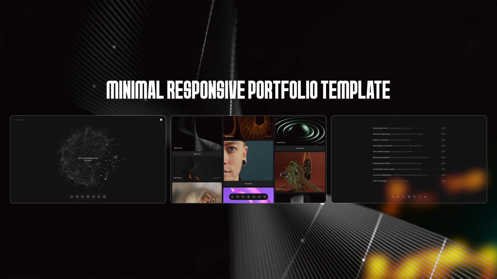

# Soren - Creative Portfolio Template



A modern, interactive creative portfolio template built with React and powered by cutting-edge web technologies. Perfect for developers, designers, and creative professionals looking to showcase their work with style.

## 🌐 Live Preview

**[View Live Demo](https://website-template-15.vercel.app/)**

## ✨ Features

- **Modern Design**: Clean, minimalist interface with smooth animations
- **Interactive Elements**: Engaging hover effects and transitions
- **Responsive Layout**: Fully responsive across all devices
- **3D Components**: Integrated Spline 3D models for enhanced visual appeal
- **Smooth Animations**: GSAP and Framer Motion powered animations
- **Navigation Dock**: macOS-inspired dock navigation
- **Multiple Sections**: Home, Work, Projects, and Photos galleries
- **Fast Performance**: Built with Vite for optimal loading speeds

## 🛠️ Built With

- **React 18** - Modern React framework
- **Vite** - Next generation frontend tooling
- **React Router** - Client-side routing
- **GSAP** - Professional-grade animation library
- **Framer Motion** - Motion library for React
- **Spline** - 3D design tool integration
- **React Icons** - Popular icons library

## 🚀 Getting Started

### Prerequisites

- Node.js (v14 or higher)
- npm or yarn

### Installation

1. Clone the repository
```bash
git clone https://github.com/Alexey9911/website-template-15.git
cd website-template-15
```

2. Install dependencies
```bash
npm install
# or
yarn install
```

3. Start the development server
```bash
npm run dev
# or
yarn dev
```

4. Open [http://localhost:5173](http://localhost:5173) in your browser

## 📂 Project Structure

```
soren/
├── src/
│   ├── components/     # Reusable components
│   ├── pages/         # Page components
│   ├── assets/        # Static assets
│   └── styles/        # CSS files
├── public/            # Public assets
└── dist/             # Build output
```

## 🔧 Available Scripts

- `npm run dev` - Start development server
- `npm run build` - Build for production
- `npm run preview` - Preview production build
- `npm run lint` - Run ESLint

## 📱 Responsive Design

The template is fully responsive and optimized for:
- Desktop (1200px+)
- Tablet (768px - 1199px)
- Mobile (320px - 767px)

## 🎨 Customization

### Colors & Themes
Customize the color scheme by modifying the CSS variables in the main stylesheet.

### Content
Replace the placeholder content with your own:
- Update personal information in the components
- Add your own projects and work samples
- Replace images in the public folder

### 3D Models
Replace the Spline 3D models by updating the URLs in the Spline components.

## 🚀 Deployment

The template is optimized for deployment on:
- **Vercel** (Recommended)
- Netlify
- GitHub Pages
- Any static hosting service

### Deploy to Vercel

1. Connect your GitHub repository to Vercel
2. Vercel will automatically detect the Vite configuration
3. Deploy with zero configuration needed

## 📄 License

This project is licensed under the MIT License - see the [LICENSE](LICENSE) file for details.

## 🤝 Contributing

Contributions are welcome! Please feel free to submit a Pull Request.

1. Fork the project
2. Create your feature branch (`git checkout -b feature/AmazingFeature`)
3. Commit your changes (`git commit -m 'Add some AmazingFeature'`)
4. Push to the branch (`git push origin feature/AmazingFeature`)
5. Open a Pull Request

## 📞 Support

If you have any questions or need help with customization, please open an issue or contact the maintainer.

## 🌟 Show Your Support

If you like this template, please give it a ⭐ on GitHub!

---

**Template Version**: MWT April 2024  
**Built with** ❤️ **by the development community**
